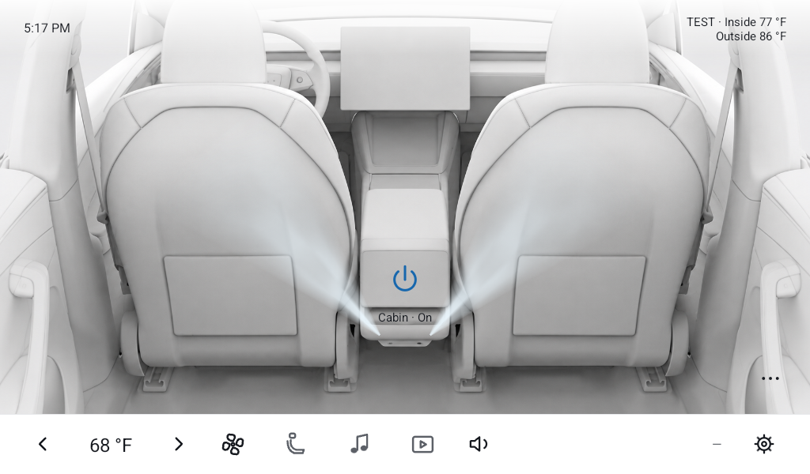
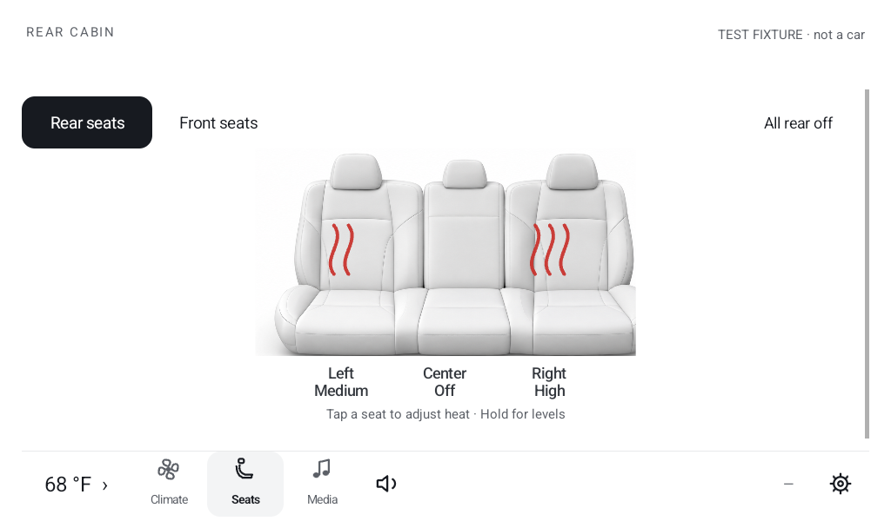
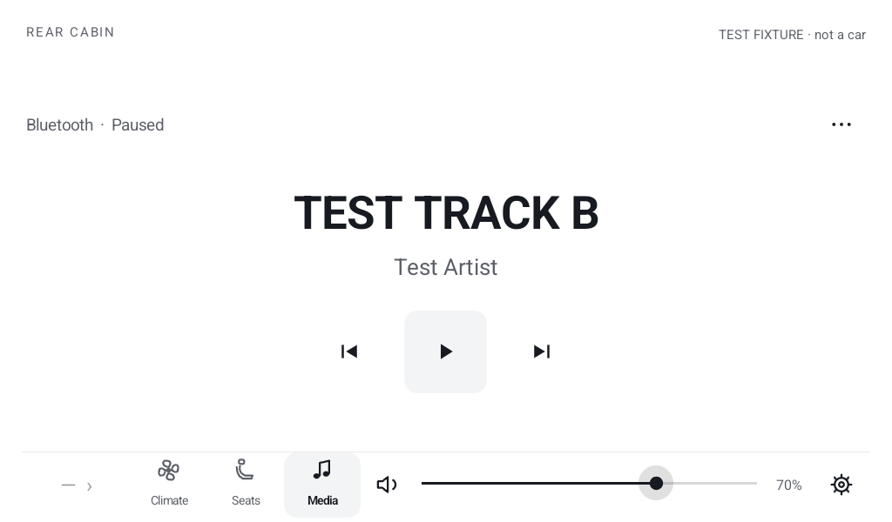
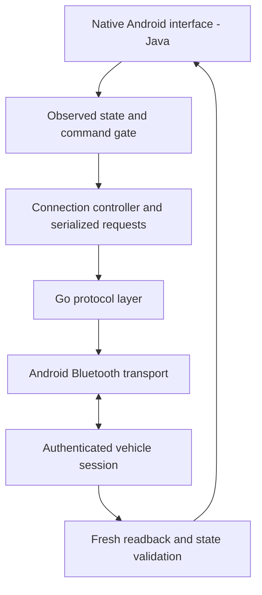

# Ludic Cabin

**An Android tablet interface for Tesla climate, seats, and media over Bluetooth Low Energy.**

I built Ludic Cabin to put useful cabin controls within reach of rear-seat passengers. The project combines a native Java interface, a Go protocol layer, authenticated Bluetooth communication, and explicit handling of connection and vehicle-state uncertainty.

**Java · Android · Go · Bluetooth Low Energy · Gradle · JVM and emulator testing**

[Back to my portfolio](https://github.com/codyglenostler) · [Engineering walkthrough](#engineering-walkthrough) · [Verification and scope](#verification-and-scope)

## See the interface

These are captures of the implemented Android app using **synthetic emulator test fixtures from September 28, 2026**. The TEST labels remain visible. They show interface behavior, not live vehicle readings. Climate shows the later build-25 design; Seats and Media show earlier verified UI iterations from the same day.

### Climate

The Climate page places the power control over a cabin illustration and keeps temperature and navigation controls in a bottom dock. Airflow is an illustration of fresh climate-on state; it does not measure airflow or steer physical vents. Pending or stale readings cannot become a confirmed On state.

### Seats

The Seats view presents left, center, and right seat heat levels spatially. A tap selects a seat; additional actions expose its heat levels. State feedback separates a requested adjustment from the latest vehicle-confirmed reading.

### Media

The Media view provides track/source information, transport controls, and volume. Missing artwork or unavailable timing is not fabricated. A shared dock keeps frequently used controls accessible across pages.

## A two-minute walkthrough

1. **Start with Climate.** Notice the large native power target and the persistent temperature dock. The UI distinguishes requested changes from current readings.
2. **Compare Seats and Media.** Each page uses the same navigation structure while making its primary task prominent. The screenshots preserve the actual test-state labels.
3. **Follow the connection boundary below.** A Bluetooth connection alone does not mean the app is authenticated, and a command acknowledgement does not prove the physical control changed.
4. **Read the recovery example.** It explains how an intermittent route update became a concrete state-management and testing problem.

## Engineering walkthrough

### Separate the interface, connection policy, and protocol

The application works locally over Bluetooth. Its core control path does not require a Tesla cloud account or a cloud backend. Vehicle access depends on local key enrollment and authenticated sessions.

| Engineering problem | Implementation approach | Why it matters |
| --- | --- | --- |
| A link can connect before authentication succeeds | Separate searching, connecting, verifying, ready, retry, and key-recovery states | The interface does not enable actions just because a Bluetooth link exists. |
| A timeout can leave a command's outcome uncertain | Keep requested targets separate from observed values; do not automatically replay uncertain actuator commands | Retrying a read and repeating a vehicle action have different consequences. |
| Climate and media share one transport | Serialize commands and foreground reads; prioritize essential current state | Optional detail reads should not destabilize core controls. |
| Old callbacks can arrive after a vehicle or session changes | Reject stale context and reset state at the connection boundary | A previous session cannot populate the current vehicle's interface. |
| Redrawing a whole page disrupts interaction | Retain views and update meaningful state changes in place | Focus, scroll position, and touch feedback remain stable. |
| Animation can misrepresent stale data or waste work | Gate it on fresh observed state and stop it for background, detachment, or reduced motion | Visual feedback follows state and lifecycle constraints. |

### Example: a destination header disappearing during a song skip

A field report described the destination header briefly disappearing when a track changed. Media commands and optional route reads shared a serialized Bluetooth connection, so a delayed route read could make the destination appear unavailable while other controls still worked.

The implemented recovery keeps the last known destination visible for a bounded interval and labels it as updating. It withholds stale miles and minutes. A fresh route restores current values; an explicit ended route clears the header. Changing vehicles or deliberately disconnecting also clears the held state. Recovery does not replay the media command.

A synthetic skip/readback test exercises the transition from current route to updating and back. This illustrates the debugging process and the state model; final in-car acceptance of every recovery case remains a separate check.

## Verification and scope

The project uses JVM unit tests for connection and state policies, Go protocol tests, Android lint and build checks, emulator UI fixtures, and separate physical-tablet checks. Historical release records distinguish these layers from real-car acceptance.

- **Inspectable here:** three app screenshots, the architecture, the interaction walkthrough, and engineering decisions.
- **Project evidence:** the September 28 build-22 record reports 113 JVM and 52 emulator checks passed. Later build-25 records report three focused animation checks, build/lint checks, and a physical-tablet installation with existing setup preserved. These are dated development results, not a new test run for this portfolio publication.
- **Still distinct:** real-car reconnection and command behavior, active animation in the car, and complete vehicle compatibility need physical acceptance. Emulator fixtures cannot establish them.
- **Distribution:** personal Android test builds. This page is a public case study; it does not distribute the private application source, APK, or vehicle credentials.

## Project context

A personal project by **Cody Ostler**, developed with AI coding assistance. My work connects product requirements, implementation iteration, debugging, tests, and device validation. This project demonstrates application and integration engineering; it does not claim to be an LLM or RAG application.

Ludic Cabin is independent and is not affiliated with or endorsed by Tesla.
